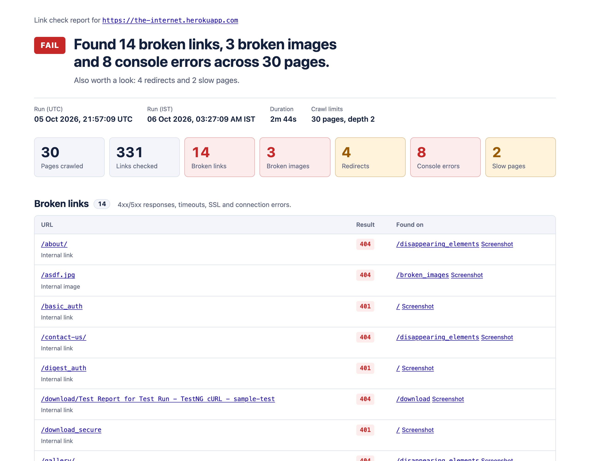
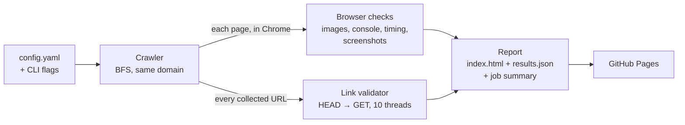
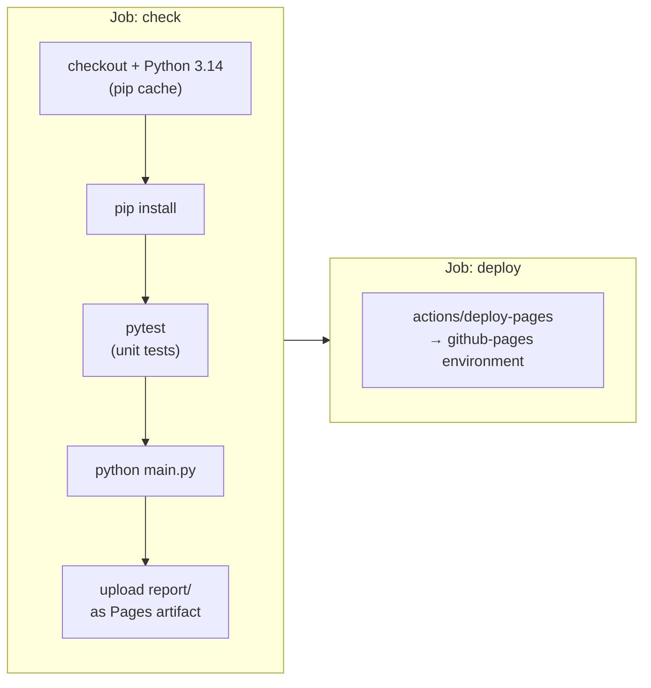

<div align="center">


# Selenium Link Checker

**Broken Link & Image Checker for Websites**

Crawls a site in headless Chrome to find broken links, broken images, JavaScript errors and slow pages, then publishes an HTML report to GitHub Pages every morning.


<br>

[](https://github.com/mainak569/selenium-link-checker/actions/workflows/link-check.yml)
[](https://mainak569.github.io/selenium-link-checker/)
[](https://github.com/mainak569/selenium-link-checker/actions/workflows/link-check.yml)

[**Live Report**](https://mainak569.github.io/selenium-link-checker/) · [Demo Video](#demo-video) · [Features](#features) · [Tech Stack](#tech-stack) · [Getting Started](#getting-started) · [How It Works](#how-it-works) · [Configuration](#configuration) · [CI/CD](#cicd) · [Testing](#testing)

</div>

---

## Demo Video

A two-minute walkthrough: crawling, browser checks, link validation, the safeguards for a flaky site, report generation, CI/CD and the live report. Every number and screenshot in it comes from a real run.

https://github.com/user-attachments/assets/2ba87668-4356-45db-80af-f66ffdc597b1

## Report Preview

<picture>
  <source media="(prefers-color-scheme: dark)" srcset="docs/report-screenshot-dark.png">
  
</picture>

The default target is [the-internet.herokuapp.com](https://the-internet.herokuapp.com), a practice site that is broken on purpose, so the report always has real findings. A typical run checks a few hundred links across 30 pages in a few minutes. The report says FAIL because of those planted bugs; the workflow itself stays green unless `fail_on_broken` is turned on.

## Features

**What it checks**

- **Broken links**: every unique link and image URL on the crawled pages, internal and external, 10 at a time. HEAD first, GET as a fallback.
- **Broken images**: images the browser finished loading but couldn't draw, including ones whose URL returns 200.
- **JavaScript console errors**: SEVERE entries from Chrome's console, grouped by message across pages.
- **Slow pages**: load time from the Navigation Timing API, flagged above a threshold.
- **Redirects**: listed as warnings with their final URL, so the links can be updated.

**How it reports**

- A self-contained `index.html` (no external CSS or JS, works offline, light and dark mode), plus `results.json` with the same data.
- Screenshots of every page that has a problem.
- A summary table on the GitHub Actions run page.
- A daily CI run that publishes the latest report to GitHub Pages, even when the check fails.

**How it stays accurate**

- Pages are checked with `requests` before Chrome opens them, so 404s, login prompts and downloads never reach the browser.
- Timeouts, connection errors, 429 and 5xx are retried; 404s aren't.
- Pages with problems are loaded again after the crawl, and only problems that happen both times are reported.
- If Chrome gets stuck on a page, a fresh browser takes over and the crawl carries on.
- `alert()`, `confirm()` and `prompt()` pop-ups are logged instead of shown, so they can't freeze the crawl.

### Why Selenium and not just `requests`?

A plain HTTP client only sees the server's response. Several real problems only show up once a browser renders the page:

| Problem | `requests` alone | With a real browser |
| --- | --- | --- |
| Links added by JavaScript after page load | Missed: they aren't in the raw HTML | Collected from the live DOM after scripts have run |
| An image URL that returns 200 but isn't a valid image | Looks fine | Caught: `img.complete && img.naturalWidth === 0` |
| JavaScript errors (e.g. `Uncaught TypeError` on `/javascript_error`) | Invisible | Read from Chrome's console log |
| How long the page really takes to load | Only time-to-response | Navigation Timing API: everything up to the load event |
| What the page looked like when it broke | Nothing | Screenshot saved with the report |

`requests` is still used where it is better: checking HTTP status codes (Selenium has no API for them), and checking hundreds of links in parallel without opening each one in a browser.

## Tech Stack

| Tool | Used for |
| --- | --- |
| **Python 3.14** | The checker itself (3.10+ works) |
| **Selenium 4.50 + headless Chrome** | Loading pages, reading the live DOM, console logs, timing and screenshots. Selenium Manager downloads the matching chromedriver. |
| **requests 2.34** | Status codes and redirects, HEAD → GET fallback, parallel checks with a thread pool |
| **Jinja2 3.1** | Rendering the HTML report, with autoescaping on |
| **PyYAML 6.0** | Reading `config.yaml` |
| **pytest 9.1** | 71 unit tests and 2 integration tests |
| **GitHub Actions** | Daily schedule, running the tests and the checker |
| **GitHub Pages** | Hosting the latest report |

## Getting Started

Needs Python 3.10+ and Google Chrome.

```bash
git clone https://github.com/mainak569/selenium-link-checker.git
cd selenium-link-checker
python3 -m venv .venv
source .venv/bin/activate          # Windows: .venv\Scripts\activate
pip install -r requirements.txt

python main.py                     # uses config.yaml
open report/index.html             # macOS; or open it in any browser
```

More examples:

```bash
python main.py --url https://example.com --max-pages 10 --max-depth 1
python main.py --headed --max-pages 3            # watch the browser work
python main.py --fail-on-broken                  # exit code 1 if anything is broken
python main.py --config my-site.yaml --output out/
python main.py --help
```

| Exit code | Meaning |
| --- | --- |
| `0` | Run finished (problems may have been found, but `fail_on_broken` is off) |
| `1` | Problems found and `fail_on_broken` is on |
| `2` | The checker couldn't do its job: bad config, start page unreachable, Chrome failed to start |

Broken links, broken images and console errors count as problems. Redirects and slow pages are warnings: they are reported but don't fail the run.

## How It Works



1. **Config** (`checker/config.py`): defaults, then `config.yaml`, then CLI flags, validated before anything runs.
2. **Crawl** (`checker/crawler.py`): takes URLs from a queue, oldest first. Each page is checked with `requests` before Chrome opens it. Links are read from the live DOM, normalised and de-duplicated, and same-site links within `max_depth` are queued.
3. **Browser checks** (`checker/browser_checks.py`): for every page, wait for `document.readyState == "complete"`, then read broken images, console errors and load time, and take a screenshot. Pages with problems are loaded once more after the crawl to confirm them.
4. **Link validation** (`checker/link_validator.py`): every unique URL found is checked in parallel with a thread pool.
5. **Report** (`checker/report.py`): one results dict is written as `results.json`, rendered into `index.html` with Jinja2, and summarised for the GitHub job page. Screenshots of clean pages are deleted.

## Configuration

All settings live in `config.yaml`. `--url`, `--max-pages`, `--max-depth`, `--output` and `--fail-on-broken / --no-fail-on-broken` override them for a single run.

| Key | Default | What it does |
| --- | --- | --- |
| `start_url` | `https://the-internet.herokuapp.com` | Where the crawl starts. Only this site (with or without `www.`) is crawled. |
| `max_pages` | `30` | Maximum pages opened in the browser |
| `max_depth` | `2` | Clicks away from the start page (start page = 0). Links on the last level are checked but not crawled. |
| `delay_seconds` | `1` | Pause between requests to the site while crawling |
| `timeout_seconds` | `10` | Timeout for each link check |
| `retries` | `1` | Extra attempts for timeouts, connection errors, 429 and 5xx. Set to 0 to also skip re-checking problem pages after the crawl. |
| `page_load_timeout_seconds` | `60` | Browser page load timeout (generous, because free hosting can take 30s to wake up) |
| `max_workers` | `10` | Links checked in parallel |
| `slow_page_ms` | `3000` | Pages whose load event takes longer than this are flagged |
| `fail_on_broken` | `false` | Exit with code 1 when problems are found. Off for the demo site, which is broken on purpose. |
| `ignore_patterns` | `[]` | Regexes. Matching URLs aren't crawled or checked, and console errors mentioning them are dropped. Example: `["/logout", "optimizely\\.com"]` |
| `user_agent` | `Mozilla/5.0 (compatible; selenium-link-checker/1.0; +repo URL)` | Sent by both Chrome and `requests`, so site owners can see who is crawling |

## CI/CD

`.github/workflows/link-check.yml` runs on:

- a daily schedule at 03:30 UTC (9:00 AM IST)
- every push to `main`
- manually from the Actions tab (`workflow_dispatch`), with an optional `fail_on_broken` switch



- If the unit tests fail, nothing is published.
- The report is uploaded even if the checker exits with code 1. The deploy job runs whenever a report was uploaded, so **a failing run still publishes its report**, while the failed `check` job still marks the whole run red.
- A concurrency group makes overlapping runs queue instead of fighting over the Pages deployment.
- Permissions are kept to `contents: read`, `pages: write` and `id-token: write` (OIDC for the Pages deploy). No secrets are needed.
- The checker also writes a summary table to the run page through `GITHUB_STEP_SUMMARY`.

## Testing

```bash
pytest                    # 71 unit tests, no network or browser, a few seconds
pytest -m integration     # real Chrome: the demo site's /broken_images page, and an alert() pop-up
```

Integration tests are excluded by default in `pytest.ini` because they need the network and a local Chrome. CI runs the unit tests before every check.

| File | Covers |
| --- | --- |
| `tests/test_link_validator.py` | Mocked responses: 200, 301 → 200, 404, 500, timeout, connection error, SSL error, HEAD 405/403/501 → GET, retries, parallel validation |
| `tests/test_urls.py` | Relative links, fragments, duplicates, `mailto:`/`tel:`/`javascript:`/`data:`, same-site vs external, ignore patterns |
| `tests/test_crawler.py` | BFS order, depth and page limits, skipped non-HTML/404 pages, re-checking problem pages after the crawl, 5xx page retry, replacing a stuck browser (fake browser) |
| `tests/test_config.py` | CLI overrides YAML, `--no-fail-on-broken`, validation errors |
| `tests/test_report.py` | `index.html` and `results.json` counts, HTML escaping, relative paths, screenshot pruning, job summary |
| `tests/test_integration.py` | At least 2 broken images found on `/broken_images` and the working image isn't flagged; an `alert()` on page load is reported as a console error without blocking the crawl |

## Design Decisions

- **Explicit waits only.** `WebDriverWait` polls for `document.readyState == "complete"`, for `loadEventEnd` to be set, and for images to finish loading. `time.sleep` is used only for the politeness delay and retry backoff, never to wait for the page.
- **Check pages with `requests` before opening them in Chrome.** Selenium can't see HTTP status codes, and opening a 401 page, a PDF or a ZIP in the browser wastes time or triggers auth prompts and downloads. The result is reused, so those URLs aren't requested twice.
- **HEAD first, GET as fallback.** HEAD skips the body. Some servers reject or mishandle it (403/405/501, dropped connections), so those are retried with a streaming GET that only reads the headers.
- **Retry only what can recover.** Timeouts, connection errors, 429 and 5xx get one more attempt. A 404 or an SSL error won't fix itself, so it isn't retried.
- **Re-check problem pages after the crawl.** The demo host sometimes answers 503 after a 30s stall, especially while it warms up, which makes CSS, JS and images fail at random. Pages with broken images or console errors are loaded again once the crawl is done, minutes later, and only problems that happen both times are reported. Reloading straight away tended to land in the same bad patch. It's the same idea as re-running failed tests at the end of a suite.
- **One stuck page can't end the run.** If Chrome stops responding (chromedriver's "Timed out receiving message from renderer" after a hung load), the page is recorded as failed, the crawler quits that browser, starts a fresh one and carries on. `main.py` still quits whichever browser is current in a `finally` block.
- **Pop-ups can't freeze the crawl.** An `alert()` blocks the page and every WebDriver command until someone clicks it. Before any page script runs, `alert`, `confirm` and `prompt` are replaced (through Chrome DevTools' `Page.addScriptToEvaluateOnNewDocument`) with versions that log the message as a console error and answer "Cancel", the least risky answer. On the demo site this surfaced an `alert(document.domain)` injected through an uploaded file name on `/download`.
- **Group console errors.** Query strings are stripped from URLs inside messages, so the same failing tracker call shows up as one row listing every page it appeared on, not hundreds of rows.
- **Screenshot every page, keep only the bad ones.** Whether a page links to something broken is only known after link validation, when the browser has already moved on. Taking the screenshot while the page is open is cheap; going back would cost a page load.
- **Politeness.** A delay between page loads, a user agent that names the tool, and a cap on parallel link checks.
- **Safe reports.** Jinja2 autoescaping is on, because console messages and URLs come from the site under test.

## Limitations

- **Sites that block bots** (Cloudflare challenges, LinkedIn's status 999, rate limits) can show up as broken links. Add them to `ignore_patterns`.
- **Login-protected pages** are reported as broken (401), like `/basic_auth` on the demo site. There is no login support.
- **Same-site crawl only.** External links are checked but not crawled. Subdomains count as external.
- **Links that appear only after user interaction** (hover menus, infinite scroll, clicks), or inside iframes or shadow DOM, aren't collected.
- **One browser, one page at a time**, so a 30-page crawl takes a few minutes. Link checks are the parallel part.
- **Third-party noise.** A failing analytics or ad script counts as a console error until you ignore it.
- **The re-check load is partly served from the browser cache**, so a resource that failed once may not be requested again. A problem that only happens some of the time (a real race condition) can also be dropped. The trade-off favours fewer false alarms in a daily report.

## Roadmap

- Keep results from every run and show history and trends (new vs fixed issues)
- Email or Slack alerts when new broken links appear
- Read URLs from `sitemap.xml` instead of, or as well as, crawling
- Crawl with several browsers in parallel (a pool of drivers or Selenium Grid) for large sites
- Login support for checking pages behind authentication

## Project Structure

```
selenium-link-checker/
├── checker/
│   ├── config.py           load config.yaml, merge CLI overrides, validate
│   ├── browser.py          start headless/headed Chrome with console logging
│   ├── crawler.py          BFS crawl, URL normalisation and filtering, re-checks
│   ├── browser_checks.py   broken images, console errors, load time, screenshots
│   ├── link_validator.py   parallel HTTP checks with HEAD → GET fallback and retries
│   └── report.py           results.json, index.html, GitHub job summary
├── templates/
│   └── report.html.j2      the report page
├── tests/                  unit tests + two integration tests
├── .github/workflows/
│   └── link-check.yml      daily check and Pages deploy
├── docs/                   logo and report screenshots for this README
├── main.py                 command-line entry point
├── config.yaml             default settings
└── requirements.txt        pinned dependencies
```

<div align="center">

Made by [@mainak569](https://github.com/mainak569)

</div>
